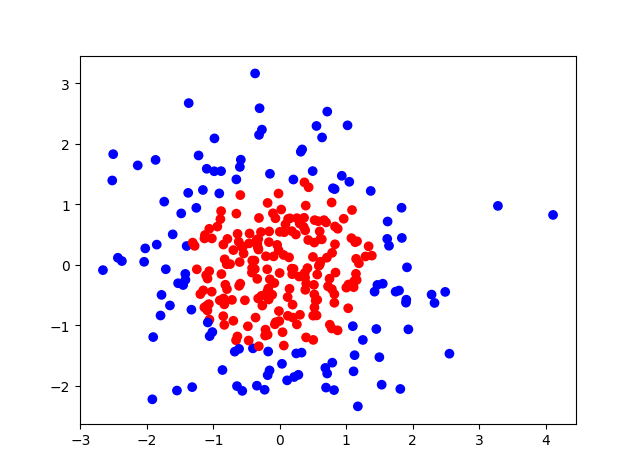
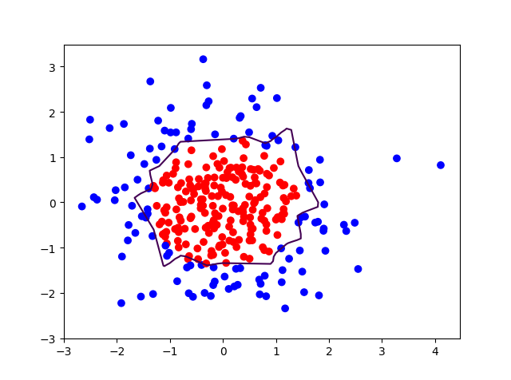

# 北京大学：人工智能实践：Tensorflow笔记

## 1. 环境搭建

ubuntu安装和python安装

### 1.1 概述

### 1.2 双系统安装

下载[Ubuntu LTS](http://www.ubuntu.org.cn/download)系统

### 1.3 Windows 虚拟机安装

windows下载[VirtualBox](https://www.virtualbox.org/wiki/Downloads)或[Vmare](https://www.vmware.com/cn.html),可以安装虚拟机

### 1.4 Win10 应用商店可以直接安装ubuntu


### 1.4 Mac Tensorflow 安装

安装Anaconda或pip安装管理python包

## 2. python 基础

### 2.1 Linux 命令、hello world

- Linux 命令
    - cd ： 到要的路径
    - ls ： 列出路径文件
    - vim ：编辑器
    - gedit : 编辑器
    - cat ： 查看文件内容
    - touch ：新建文件
    - mkdir ：新建文件夹
    - python ：运行python脚本
    - find ：查找
    - mv ：移动文件(夹)
    - cp : 复制文件(夹)

- hello world

```python
print('hello world')
```

### 2.2 列表、元组、字典

序列是Python中最基本的数据结构。序列中的每个元素都分配一个数字 - 它的位置，或索引，第一个索引是0，第二个索引是1，依此类推。Python有6个序列的内置类型，但最常见的是列表和元组。序列都可以进行的操作包括索引，切片，加，乘，检查成员。

- 列表

```python
list1 = ['physics', 'chemistry', 1997, 2000]
list2 = [1, 2, 3, 4, 5 ]
list3 = ["a", "b", "c", "d"]
```

函数 | 解释
------|------
cmp(list1, list2) |比较两个列表的元素
len(list) |列表元素个数
max(list) | 返回列表元素最大值
min(list) | 返回列表元素最小值
list(seq) | 将元组转换为列表

list函数 | 解释
---|---
list.append(obj) | 在列表末尾添加新的对象
list.count(obj) | 统计某个元素在列表中出现的次数
list.extend(seq) | 在列表末尾一次性追加另一个序列中的多个值（用新列表扩展原来的列表）
list.index(obj) | 从列表中找出某个值第一个匹配项的索引位置
list.insert(index, obj) | 将对象插入列表
list.pop([index=-1]) | 移除列表中的一个元素（默认最后一个元素），并且返回该元素的值
list.remove(obj) | 移除列表中某个值的第一个匹配项
list.reverse() | 反向列表中元素
list.sort(cmp=None, key=None, reverse=False) | 对原列表进行排序

---------------------------------------------------------

- 元组

Python的元组与列表类似，不同之处在于元组的元素不能修改。元组使用小括号，列表使用方括号。元组创建很简单，只需要在括号中添加元素，并使用逗号隔开即可。

```python
tup1 = ('physics', 'chemistry', 1997, 2000)
tup2 = (1, 2, 3, 4, 5 )
tup3 = "a", "b", "c", "d"
```

Python 表达式 |   结果 |   描述
---|---|---
len((1, 2, 3)) |   3 |   计算元素个数
(1, 2, 3) + (4, 5, 6) |   (1, 2, 3, 4, 5, 6) |   连接
('Hi!',) * 4 |   ('Hi!', 'Hi!', 'Hi!', 'Hi!') |   复制
3 in (1, 2, 3) |   True |   元素是否存在
for x in (1, 2, 3): print x, |   1 2 3 |   迭代

tuple函数   | 方法及描述
---|---
cmp(tuple1, tuple2) | 比较两个元组元素
len(tuple)  | 计算元组元素个数
max(tuple) | 返回元组中元素最大值
min(tuple) | 返回元组中元素最小值
tuple(seq) | 将列表转换为元组

-------------------------------------------------------------

- 字典

字典是另一种可变容器模型，且可存储任意类型对象。字典的每个键值 key=>value 对用冒号 : 分割，每个键值对之间用逗号 , 分割，整个字典包括在花括号 {} 中。 d = {key1 : value1,key2 : value2,key3 : value3}

函数 | 描述
---|---
cmp(dict1, dict2) | 比较两个字典元素
len(dict) | 计算字典元素个数，即键的总数
str(dict) | 输出字典可打印的字符串表示
type(variable) | 返回输入的变量类型，如果变量是字典就返回字典类型

dict函数 | 描述
dict.clear() | 删除字典内所有元素
dict.copy() | 返回一个字典的浅复制
dict.fromkeys(seq[, val]) | 创建一个新字典，以序列 seq 中元素做字典的键，val 为字典所有键对应的初始值
dict.get(key, default=None) | 返回指定键的值，如果值不在字典中返回default值
dict.has_key(key) | 如果键在字典dict里返回true，否则返回false
dict.items() | 以列表返回可遍历的(键, 值) 元组数组
dict.keys() | 以列表返回一个字典所有的键
dict.setdefault(key, default=None) | 和get()类似, 但如果键不存在于字典中，将会添加键并将值设为default
dict.update(dict2) | 把字典dict2的键/值对更新到dict里
dict.values() | 以列表返回字典中的所有值
pop(key[,default]) | 删除字典给定键 key 所对应的值，返回值为被删除的值。key值必须给出。 否则，返回default值
popitem() | 随机返回并删除字典中的一对键和值

### 2.3 条件语句

```python
if 判断条件：
    执行语句……
else：
    执行语句……
###################
if 判断条件1:
    执行语句1……
elif 判断条件2:
    执行语句2……
elif 判断条件3:
    执行语句3……
else:
    执行语句4……
```

### 2.4 循环语句

- while

```python
while 判断条件：
    执行语句……
```

- for

```python
for iterating_var in sequence:
    statements(s)
```

- 循环嵌套

```python
for iterating_var in sequence:
   for iterating_var in sequence:
      statements(s)
   statements(s)
```

```python
while expression:
   while expression:
      statement(s)
   statement(s)
```

### 2.5 turtle模块

### 2.6 文件操作

### 2.7 类、对象、面向对象编程

### 2.8 文件操作

## 3. Tensorflow 基本概念

### 3.1 张量、计算图、会话

### 3.2 前向传播

### 3.3 反向传播

## 4. 神经网络基本概念

### 4.1 损失函数

预测值和真实值的差距

- mse(均方损失函数): (y_p - y_t)^2

```python
    loss_mes = tf.reduce_mean(tf.square(y_p - y_t))
```

- CE(交叉熵): -y_t*log(y_p)

```python
    ce = -tf.reduce_mean(y_t*tf.log(tf.clip_by_value(y_p,1e-12,1.0)))
```

    **使用softmax的话用下面代码**

```python
    ce = tf.nn.spare_sotfmax_cross_entropy_with_logits(logits = y_p,labels = tf.argmax(y_t,1)) 
    cem = tf.reduce_mean(ce)
```

- 自定义loss:

```python
loss = tf.reduce_sum(tf.where(tf.greater(y_t,y_p),alpha*(y_t,y_p),(1-alpha)*(y_p-y_t)))
# 可以通过设置不同的 **alpha** 使预测往预想的方向偏移，也可以用来调节样本不平衡
```

### 4.2 学习率

每次参数更新的幅度，学习率大了震荡不收敛，小了收敛速度慢

- 指数衰减学习率
    lr = lr_base * lr_decay ^ ( global_step/learn_rate_step)
    - lr_base : 基础学习率
    - lr_decay : 衰减率
    - global_step : 运行几轮
    - learn_rate_step : 多少轮衰减一次

```python
global_step = tf.Variable(0,trainable = False)
lr = tf.train.exponential_decay(
    lr_base,
    global_step,
    learn_rate_step,
    lr_decay,
    staircase = Ture) #staircase = Ture 时，global_step/learn_rate_step 取整
```

### 4.3 滑动平均

记录了每个参数一段时间内过往值的平均，增加了模型泛化性

```math
滑动平均值 = 衰减率 * 滑动平均值(前一次) + (1 - 衰减率) * 参数值        滑动平均初值 = 参数初值
衰减率 = min{MOVING_AVERAGE_DECAY, (1 + 轮数) / (10 + 轮数)}
```

```python
ema = tf.train.ExponentialMovingAverage(MOVING_AVERAGE_DECAY,global_step)
ema_op = ema.apply(tf.trainable_variables())        #所有待优化的参数求滑动平均
with tf.contral_dependencies([train_step,ema_op]):  #滑动平均和训练绑定为一个节点
    train_op = tf.no_np(name='train')
```

### 4.4 正则化

正则化缓解过拟合，在损失函数中引入模型复杂度指标，利用其给**W加权值**，软化训练数据噪声(一般不对偏置b正则化)

```math
loss = loss(y_p,y_t) + REGULARIZER * loss(w)
第一个loss表示模型中所有参数的损失函数，第二个loss是需要正则化的参数,REGULARIZER超参
```

- l1 一节正则化， loss_l1(w) = sum(abs(w))

```python
loss(w) = tf.contrib.layers.l1_regularizer(REGUIARIZER)(w)
```

- l2 二阶正则化， loss_l2(w) = sum(w^2)

```python
loss(w) = tf.contrib.layers.l2_regularizer(REGUIARIZER)(w)
```

使用

```python
tf.add_to_collection('losses',tf.contrib.layers.l2_regularizer(regularizer)(w)) #把内容加到集合，对应位置做加法
loss = cem + tf.add_n(tf.get_collecton('losses))
```



- 生成点可视化


- 无正则化训练结果



- 正则化训练结果

### 4.5 神经网络搭建八股

1. forward.py

```python
    def forward(x,regularizer):
        w = 
        b = 
        y = 
        return y

    def get_weight(shape,regularizer):
        w = tf.Variable()
        tf.add_to_collection('losses',tf.contrib.l2_regularizer(regularizer)(w))
        return w

    def get_bias(shape):
        b = tf.Variable()
        return b
```

2. backward.py

```python
def backward():
    x = tf.placeholder()
    y_ = tf.placeholder()
    y = forward.forward(x,REGULARIZER)
    global_step = tf.Variable(0,trainable=False)
    loss = 

均方差
loss_mes = tf.reduce_mean(tf.square(y_p - y_t))
交叉熵
ce = tf.nn.spare_sotfmax_cross_entropy_with_logits(logits = y_p,labels = tf.argmax(y_t,1))
loss_ce = tf.reduce_mean(ce)

正则化
loss = loss_base + tf.add_n(tf.get_collection('losses'))

指数衰减学习率
lr = lr_base * lr_decay ^ ( global_step/learn_rate_step)
- lr_base : 基础学习率
- lr_decay : 衰减率
- global_step : 运行几轮
- learn_rate_step : 多少轮衰减一次

滑动平均
ema = tf.train.ExponentialMovingAverage(MOVING_AVERAGE_DECAY,global_step)
ema_op = ema.apply(tf.trainable_variables())        #所有待优化的参数求滑动平均
with tf.contral_dependencies([train_step,ema_op]):  #滑动平均和训练绑定为一个节点
    train_op = tf.no_np(name='train')


train_step = tf.train.GradientDesentOptimizer(lr).minimize(loss,global_step = global_step)

with tf.Session() as sess:
    init_op = tf.global_variables_initializer()
    sess.run(init_op)

    for i in range(STEPS):
        sess.run(train_step,feed_dict={x: ,y_: })
        if i % 轮数 ==0：
            print

if __name__ = '__main__':
    backward()

```

## 5. MNIST识别-1

### 5.1 MNIST数据集

### 5.2 模块搭建神经网络八股

### 5.3 手写数字设别准确率输出

## 6. MNIST识别-2

### 6.1 输入手写数字图片输出识别结果

### 6.2 制作数据集

## 7. 卷积神经网络基础

### 7.1 卷积神经网络

### 7.2 lenet5代码

## 8. vgg16

### 8.1 复现已有的卷积神经网络

### 8.2 用vgg16 实现图片识别